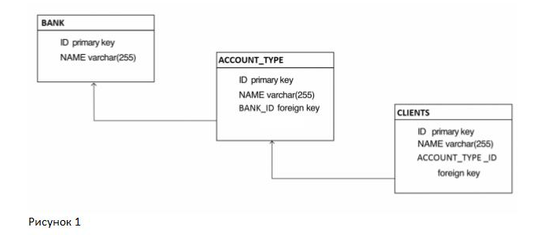
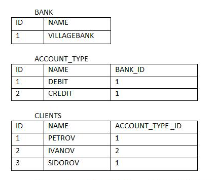

## 6 модуль

Дана база данных с тремя таблицами. Банк (BANK), тип счета (ACCOUNT_TYPE) и клиенты (CLIENTS). (см. рис1)

В каждой таблице есть поля "ID" и "NAME". В таблице "ACCOUNT_TYPE" есть третье поле " BANK_ID", а в таблице "CLIENTS " есть третье поле "ACCOUNT_TYPE _ID ".
У нас один банк "VILLAGEBANK", банк маленький в нём два типа счетов "DEBIT" и "CREDIT" и у каждого клиента может быть только один счёт.

Таблицы:

Отношение таблиц BANK и ACCOUNT_TYPE один ко многим. Отношение таблиц ACCOUNT_TYPE и CLIENTS, также один ко многим.

Используя JPA и Spring создайте программу, которая сможет добавлять, удалять и обновлять клиентов.

## 7 модуль

☑☑ 1. Представим, что в будущем нашим приложением будут пользоваться несколько операторов. Когда один внесёт изменения в базу данных, то другой может не увидеть этих изменений. Добавьте полную очистку кэша.

☑☑ 2. В таблицу "CLIENTS" добавьте поле "DATE_ACC". При добавлении нового клиента, должна вручную устанавливаться дата открытия счёта.

☑☑ 3. Выведите список имён клиентов и даты открытия счетов.

☑☑ 4. Выведите список клиентов, которые появились у банка за сегодня.

☑☑ 5. Выведите список клиентов, у которых тип счёта "DEBIT".

☑☑ 6. Выведите типы счётов и количество клиентов, у которых есть счёт каждого типа.

☑☑ 7. Выборка с использованием оператора LIKE: выведите список клиентов, имеющих тип счета начинающийся с "C".