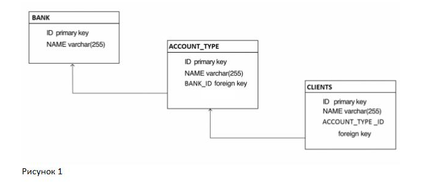
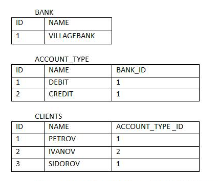

Дана база данных с тремя таблицами. Банк (BANK), тип счета (ACCOUNT_TYPE) и клиенты (CLIENTS). (см. рис1)

В каждой таблице есть поля "ID" и "NAME". В таблице "ACCOUNT_TYPE" есть третье поле " BANK_ID", а в таблице "CLIENTS " есть третье поле "ACCOUNT_TYPE _ID ".
У нас один банк "VILLAGEBANK", банк маленький в нём два типа счетов "DEBIT" и "CREDIT" и у каждого клиента может быть только один счёт.

Таблицы:

Отношение таблиц BANK и ACCOUNT_TYPE один ко многим. Отношение таблиц ACCOUNT_TYPE и CLIENTS, также один ко многим.

Используя JPA и Spring создайте программу, которая сможет добавлять, удалять и обновлять клиентов.